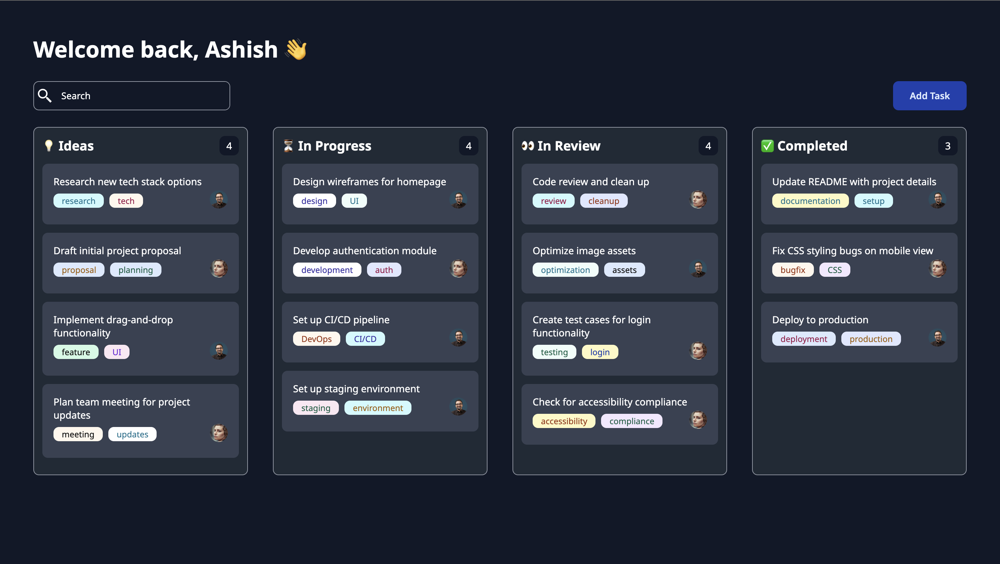
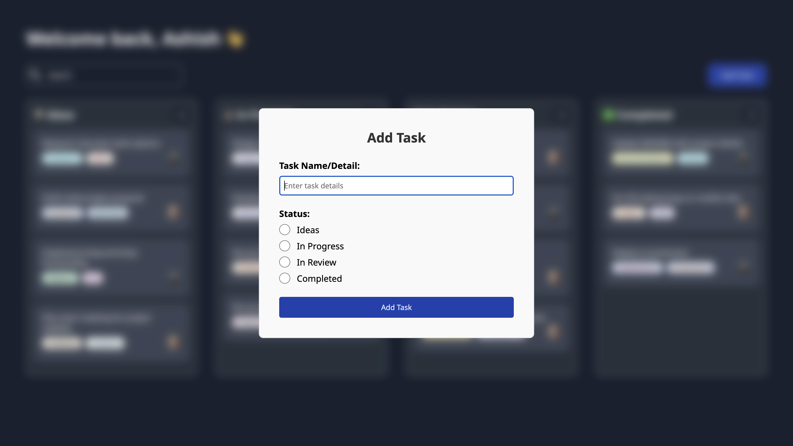

# Kanban Board Project

This is a simple and interactive Kanban board built with HTML, CSS, and vanilla JavaScript. It allows users to create, manage, and organize tasks through a user-friendly interface. I'm revisiting and practicing raw HTML, CSS, and JavaScript through this project, as it's been a while since I last worked with these technologies directly.

Project Video :- [Youtube](https://youtu.be/CpUk-8dgjhY)

## Features

- **Add New Cards:** Easily add new cards with task details and status options to organize tasks by stage.
- **Drag and Drop Functionality:** Drag and drop cards between different stages (Ideas, In Progress, In Review, Completed) to track task progress visually.
- **Persistent Data:** All changes (new cards, updated statuses) are saved locally, so data is preserved even after page refreshes.
- **Search Functionality:** Quickly search through tasks to find specific cards by their task name.

## Usage

1. **Add a New Card:** Click the "Add Task" button, fill in the task details, and assign a status to add it to the board.
2. **Drag and Drop:** Click and drag cards to move them between different board sections.
3. **Search:** Use the search bar to filter and find specific tasks instantly.

## Project Urls

**Deployed Link** https://ashishcumar.github.io/kanban-board/
**Project Video** [Youtube](https://youtu.be/CpUk-8dgjhY)
